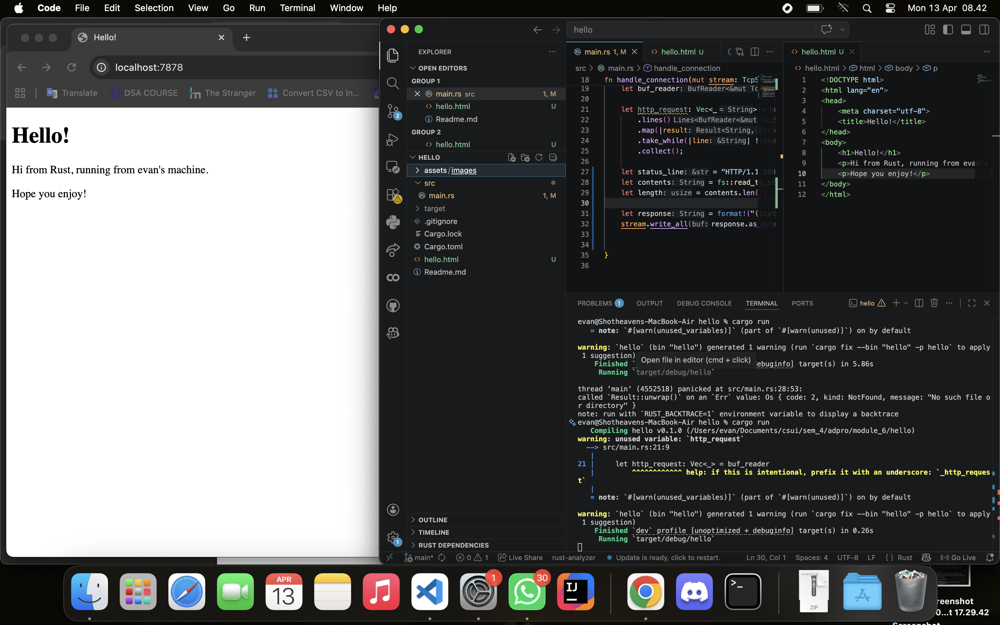
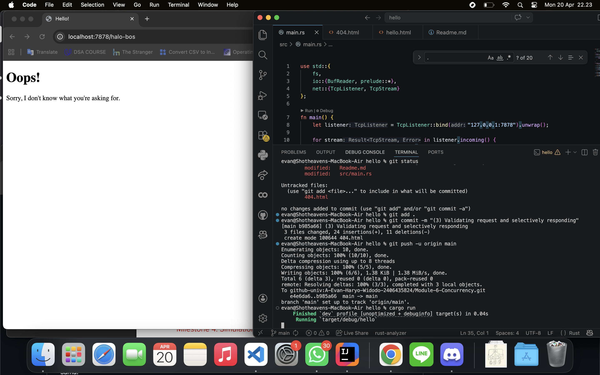
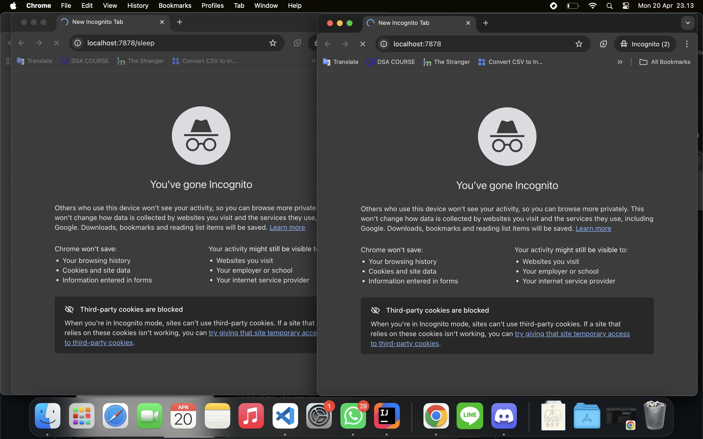
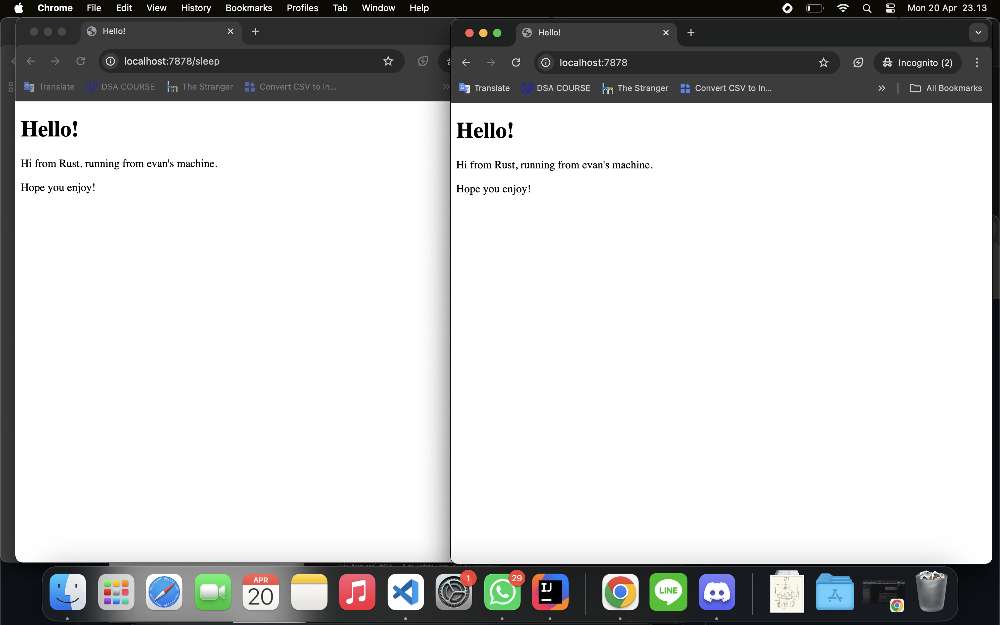

# REFLECTION
Kumpulan refleksi milestones module-6
## Commit 1 Reflection notes (Milestone 1: Single threaded web server)
Bagian pertama ini membahas tentang cara mengimplementasikan server TCP sederhana, melalui pemanggilan TcpListener untuk membuka port / mendengarkan koneksi TCP yang masuk dari sisi klien dan TcpStream untuk handling komunikasi antara server dan client. Melalui stream, server akan membaca request dari client dan mengirimkan response kembali ke client. Lalu, fungsi handle_connection  berfungsi untuk handling TcpStream lebih lanjut, yakni mengekstraksi data request tersebut menggunakan BufReader. Di dalam fungsi ini, data mentah dari jaringan diproses baris demi baris melalui memori buffer dan akan berhenti membaca ketika menemukan baris kosong. Nantinya fungsi handle_connection akan mengembalikan apa saja yang direquest browser kita ke server kita melalui port tcp yang didefinisikan. Beberapa pengembaliannya adalah http method, request-URI, HTTP-Version, dan http headers. Selain itu, browser akan melakukan multiple request untuk mendapatkan assets tambahan yang dimuat pada http response.

## Commit 2 Reflection notes (Milestone 2: Returning HTML)
Bagian kedua ini melakukan update kode pada fungsi handle_connection yang mendemonstrasikan server membangun dan mengirimkan response HTTP yang valid kepada client. Penggunaan fs::read_to_string menunjukkan mekanisme server mengakses sistem file lokal untuk membaca dan menyajikan dokumen statis, dalam hal ini adalah load isi file hello.html ke dalam memori. Lalu, server juga merangkai sebuah status line standar, yakni "HTTP/1.1 200 OK" yang memberikan informasi kepada client bahwa permintaannya valid dan berhasil dipenuhi. Selain itu, server juga mengirimkan perhitungan ukuran dokumen dari hello.html ke dalam parameter header Content-Length untuk memberikan instruksi kepada browser terkait total byte data body yang harus diunduh. Pengiriman response yang diformatting, seperti ini, {status_line}\r\nContent-Length: {length}\r\n\r\n{contents}, bertujuan untuk memenuhi syntax protokol HTTP, yang mana "{status_line}\r\n" sebagai pemisah antar baris header dan \r\n\r\n berfungsi sebagai batas penanda yang memisahkan area header dari message-body (isi html). Poin terakhir, kita juga harus memastikan file hello.html diletakkan di luar folder src atau sejajar dengan Cargo.toml karena saat dieksekusi menggunakan perintah cargo run, Rust menjadikan root directory proyek untuk mencari file dengan path relatif.

## Commit 3 Reflection notes (Milestone 3: Validating request and selectively responding)
Bagian ketiga ini melakukan update kembali pada fungsi handle_connection dengan mengimplementasikan mekanisme basic routing dan handling error HTTP. Sebelumnya, di commit kedua, kita melakukan ekstraksi seluruh header pada buffer, tetapi sekarang dioptimasi untuk hanya mengekstrak baris pertama dari permintaan (request_line) menggunakan method .next() yang memuat informasi HTTP Method dan URI/Path tujuan. Informasi tersebut kemudian digunakan sebagai checking condition pada if-else untuk menentukan respons dikembalikan server. Jika klien melakukan permintaan ke halaman utama (/), server akan memuat dokumen hello.html dan http statuscode adalah 200 OK. Sebaliknya, permintaan ke path selain path utama (/) atau yang tidak terdaftar pada server akan secara otomatis diarahkan ke kondisi else, di mana server akan mengirimkan dokumen 404.html serta http statuscode 404 NOT FOUND. Selain itu, refactoring yang dilakukan adalah menggunakan if-else  sebagai sebuah ekspresi untuk mengembalikan nilai variabel sehingga implementasi kode tidak redundan untuk fungsi yang sama.

## Commit 4 Reflection notes (Milestone 4: Simulation slow response)
Bagian keempat ini melakukan simulasi respons web lambat dengan memberikan instruksi thread::sleep pada endpoint /sleep. Alhasil,  eksekusi pemanggilan webserver mengalami perlambatan selama 5 detik atau tidak dapat langsung terbuka. Selain itu, kode tersebut secara jelas mendemonstrasikan bahwa kelemahan utama dari single-threaded adalah ketika pemrosesan terhadap satu request memakan waktu yang relatif lama akan mengakibatkan seluruh koneksi lain yang masuk ke server terblokir. Dengan kata lain, jika sebuah browser mengakses /sleep, browser lain yang mencoba mengakses halaman utama, path (/), harus menunggu hingga proses sleep tersebut selesai. Hal ini terjadi karena iterasi pada listener.incoming() ter-block dan tidak dapat memproses stream baru sebelum fungsi handle_connection() pada stream saat ini tuntas tereksekusi. Sebagai tambahan juga bahwa proses sleep ini dapat diibaratkan sebagai server harus menanggung puluhan ribu request, tetapi hanya satu thread yang jalan. Maka dari itu, implementasi multi-threaded programming sangat diperlukan untuk mengatasi concurrency request.

### Gambar proses request dengan satu thread berlangsung

### Gambar proses response berhasil

## Commit 5 Reflection notes
Bagian kelima ini menyelesaikan masalah antrean request dengan mengimplementasikan arsitektur multithreaded berbasis ThreadPool. Server kini secara efisien membatasi jumlah thread pekerja (workers) yang berjalan secara concurrent, dalam hal ini thread workers di-set sebanyak 4 threads. Pembatasan worker threads ini dilakukan agar ketika terjadi DoS (Denial of Service), resource server tidak dipaksa untuk melayaninya secara terus-terusan (mencegah resource server habis). Selain itu, implementasi ini mendemonstrasikan juga pemanfaatan message passing model, yakni dengan menggunakan mpsc::channel sebagai jembatan komunikasi antara main thread yang bertindak sebagai pengirim task dan para workers sebagai penerima. Mekanisme ini pun didukung oleh adanya Arc<Mutex<Receiver<Job>>> yang berfungsi bahwa pengambilan task oleh receiver berlangsung secara mutually exclusive (tidak akan terjadi race condition). Sebagai tambahan juga bahwa main thread dan sisa worker threads lainnya tetap terbebas dari blocking dan dapat memproses request baru secara seketika. Maka dari itu, implementasi thread pool ini sangat krusial untuk menjaga prinsip availability saat menangani concurrent request.